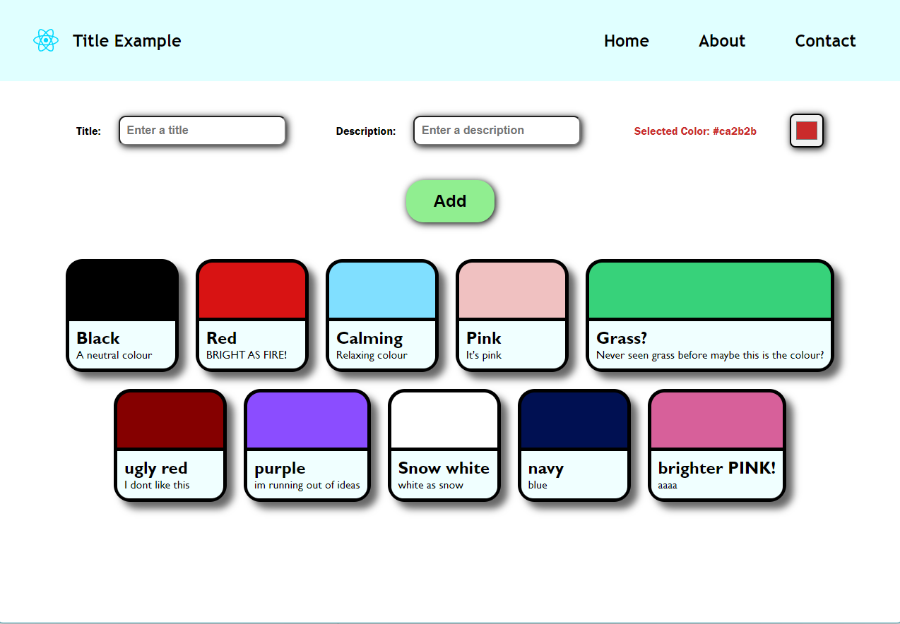

# React Card Layout Template
This is a card layout template which I created using React to practice my UI and React skills. 

The main webpage consists of 2 components, the navbar and the input. The input takes the card list as a child, which it passes the list information onto by using the React hook `createContext` and `useContext`.

To run this project, fork the repo and clone it to your machine.  
`cd` into the project folder  
Then run `npm install` to install node dependencies  
Then `npm run dev` to run it locally

I've included test data to help get a sense for what the webpage looks like in `Input.jsx`.  
To get a blank slate comment out the line that declares `tasks` and `setTasks` and uncomment the line underneath it.

Preview (with test data):  

Routes were made using the package `react-router-dom`

Potential future additions:  
- ~~Create routes for the nav bar to bring you to~~
- Draggable cards to rearrange